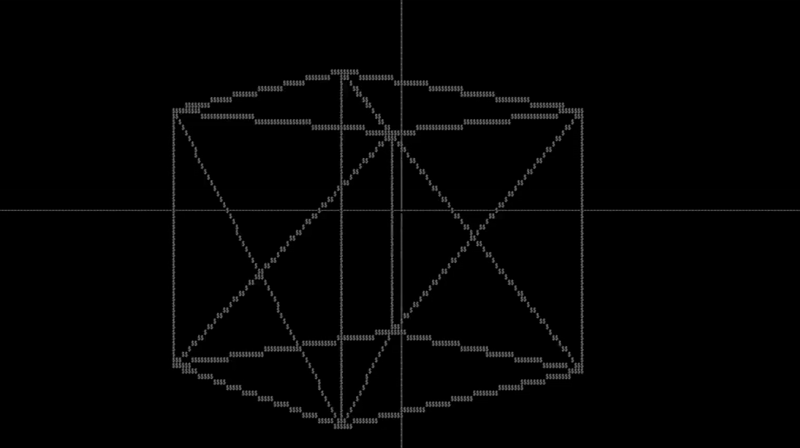

## Hi there 👋
<figure>
  
  <figcaption><em>Rotating Cube Example</em> <a href="https://github.com/SafetImamovic/terminal-3d-render-engine">Terminal 3D Render Engine in C</a></figcaption>
</figure>

## Favorite Quotes

> *"If you need more than 3 levels of indentation, you're screwed anyway, and should fix your program."*  
> — Linus Torvalds

<!--
**SafetImamovic/SafetImamovic** is a ✨ _special_ ✨ repository because its `README.md` (this file) appears on your GitHub profile.

Here are some ideas to get you started:

- 🔭 I’m currently working on ...
- 🌱 I’m currently learning ...
- 👯 I’m looking to collaborate on ...
- 🤔 I’m looking for help with ...
- 💬 Ask me about ...
- 📫 How to reach me: ...
- 😄 Pronouns: ...
- ⚡ Fun fact: ...
-->
